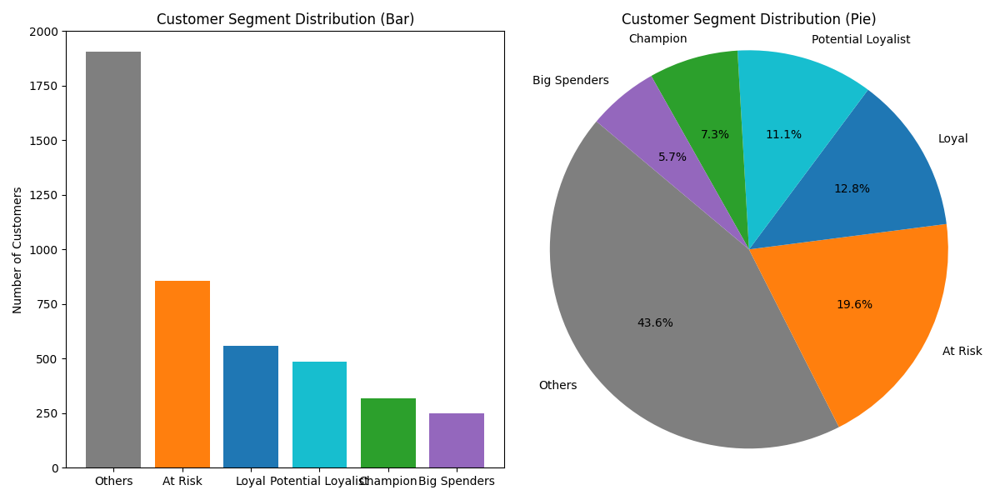

# 🎯 Customer Segmentation Analysis (RFM Modeling)



This Python project analyzes customer transaction data using **RFM (Recency, Frequency, Monetary) analysis** to identify high-value segments and at-risk customers.

---

## 📂 Files Included
- `Customer Segmentation Analysis.py` – Main analysis script.
- `data.csv` – Raw transaction data (provide your own).
- `rfm_output.csv` – Processed RFM metrics (auto-generated).
- `Customer_Segments.png` – Visualization of segment distribution.

---

## 📊 Key Features
### 1. **RFM Metric Calculation**
- **Recency**: Days since last purchase  
- **Frequency**: Number of orders  
- **Monetary**: Total spending  

### 2. **Automated Segmentation**
Classifies customers into 8 strategic groups:  
- 🏆 **Champions** (Top customers: recent, frequent, big spenders)  
- ⚠️ **At Risk** (Lapsing customers needing re-engagement)  
- 💰 **Big Spenders** (High monetary value)  
- 🔍 **Potential Loyalists** (Emerging valuable customers)  

### 3. **Visual Analytics**
- Side-by-side **bar chart** (counts) and **pie chart** (percentages).  
- Color-coded segments for quick insights.  

---

## 📦 Requirements
```bash
pip install pandas matplotlib